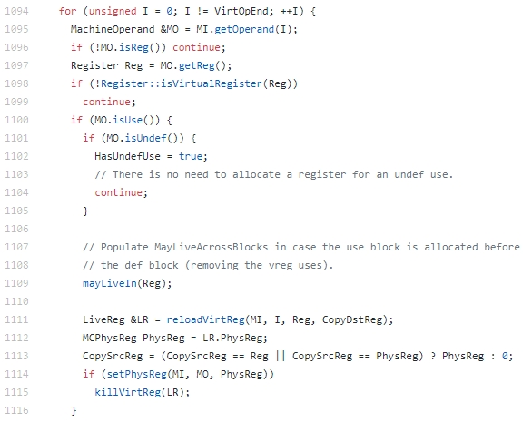

# lab4实验答案和评分标准

### LLVM源码阅读与理解

- RegAllocFast.cpp 中的几个问题

  * *RegAllocFast* 函数的执行流程？

    答：RegAllocFast的调用流程为 runOnMachineFunction -> allocateBasicBlock -> allocateInstruction。其中runOnMachineFunction函数（lines 1292-1324）初始化virtual-physical 寄存器map为空，然后对函数中逐个基本块进行寄存器分配（调用allocateBasicBlock），allocateBasicBlock函数（lines 1245-1290）会将基本块中的所有live-in寄存器标记为regReserved，然后对每条非Debug相关指令进行寄存器分配（调用allocateInstruction），allocateInstruction会通过四次遍历来分配寄存器，最后完成RegAllocFast函数的调用。

  * *allocateInstruction* 函数有几次扫描过程以及每一次扫描的功能？

    答：共四次扫描。

    第一轮遍历将physreg uses 以及earlyclobbers标记为已使用（usePhysReg），并找到最后的virtreg操作数位置（VirtOpEnd）。

    第二轮遍主要用于对virtreg uses进行分配。

    第三轮遍主要将所有physreg defs标记为已使用。

    第四轮遍历对virtreg defs进行分配，搜集并kill掉所有dead defs。该过程中主要是通过defineVirtReg -> allocVirtReg过程来分配新的物理寄存器

  * *calcSpillCost* 函数的执行流程？

    答：该函数用于计算清空指定PhysReg以及它的aliases以用于新的分配所引入的代价。

    通过查询该PhysReg及其aliases对应PhysRegState表项进行代价统计：

    - 如果该PhysReg对应的表项是regFree，那么代价为0
    - 如果该PhysReg或者它的aliases对应的表项存在一个为regReserved， 那么代价为spillImpossible（～0）
    - 如果该PhysReg对应表项为虚拟寄存器，那么如果该寄存器需要Spill（Dirty位为1），那么代价为spillDirty（100），否则为 spillClean（50）;
    - 如果该PhysReg本身是regDisabled，那么统计其aliases的代价：
      - regDisabled代价为0
      - regFree代价为1
      - 虚拟寄存器，根据Dirty位不同，代价分别为spillDirty（100），否则为 spillClean（50）

  * *hasTiedOps*，*hasPartialRedefs，hasEarlyClobbers* 变量的作用？

    答：

    ###### hasEarlyClobbers:

    earlyclobber这个概念来自gcc：https://gcc.gnu.org/onlinedocs/gcc/Modifiers.html ：

    *“‘Means (in a particular alternative) that this operand is an earlyclobber operand, which is written before the instruction is finished using the input operands. Therefore, this operand may not lie in a register that is read by the instruction or as part of any memory address.”*

    这个功能是用在C语言内嵌汇编中，用来告诉编译器如何对这样的操作数进行正确的寄存器分配：该操作数的def和use不能分配到同一个物理寄存器。

    ###### hasTiedOps:

    Tied op表示一个指令中寄存器操作数和另一个寄存器操作数相绑定，它们需要使用同一个寄存器。

    ###### hasPartialRedefs:

    PartialDefs是指在存在subregister的情况，比如2个32bit寄存器组成1个64bit寄存器，如果对其中1个32bit寄存器有def，那就相当于对64bit寄存器partial def。

- 书上所讲的算法与LLVM源码中的实现之间的不同点

  本题较为开放，只需给出一点不同即可，可考虑Copy指令处理方式，Hint寄存器使用等等。

  一些同学的答案参考：

  - 为虚拟寄存器分配物理寄存器，龙书算法中，当指令x=y为复制指令时,先分配Ry,再让Rx=Ry，当没有可供分配的物理寄存器时,需要计算所有已被分配的物理寄存器的spill cost，即spill时需生成的sw指令条数，选择其中cost的最小的，spill后分配；而fast alloator对Ry的选择先检查是否可以使用hint，若可以，就直接选择hint，若不能使用hint，才通过迭代选择spill cost最小的物理寄存器。在`allocateinstruction`函数中我们判断机器指令的`iscopy()`是否返回true，若为true，则我们将机器指令Opnum为0的操作数对应的寄存器赋给copydstreg，将copydstreg作为`reloadvirtreg`函数的Hint参数的值，`reloadvirtreg`里又将Hint作为`allocatevirtreg`函数的Hint0参数的值，在该函数中对Hint0判断，若Hint0是物理寄存器且可分配且在待分配的虚拟寄存器的类中，计算Hint0的spill cost，若spill cost<spillDirty(spillDirty值为100u),我们调用`definephysreg`函数来spill Hint0并将Hint0标记为regFree，再调用`assignvirttophysreg`函数将Hint0分配给虚拟寄存器，返回，即在Hint0可用的情况下，无需在所有物理寄存器中选择spill cost最小的物理寄存器，而直接将Hint0分配给虚拟寄存器。若Hint0不可用，调用`traceCopies`函数，该函数虚拟寄存器的定义是否为copy,若是则返回一个可合并的物理寄存器。在`allocatevirtreg`函数中为它尝试的第二个hint，设为Hint1。Hint1是否可用判断方法同Hint0。fast allocator在hint的spill cost小于某个特定值（这里为spillDirty=100u),就将hint分配给虚拟寄存器，而不迭代选择spill cost最小的物理寄存器，这样在spill cost小幅增大情况下，可以提高寄存器分配速度。
  - 根据书上的算法，对于复制指令，源操作数的物理寄存器选择一开始并没有任何偏好，当源操作数不在物理寄存器内时，只是平等的选择第一个找到的空寄存，没有空寄存器时找到一个直接替换的寄存器，再没有则选择spill代价最低的寄存器。但是LLVM源码中，源操作数的物理寄存器一开始就带有偏好，即优先选择目的操作数占用的物理寄存器（但按照课本算法，这应该属于可以直接替换的寄存器的其中之一，即课本中无空寄存器情况的可选项之一），对应代码片段如下：

  在1111行代码，reloadVirtReg函数中，最后一个参数CopyDstReg为目的操作数的寄存器编号，如果该编号为一个物理寄存器，则hint有效，此时在reloadVirtReg函数调用allocVirtReg函数时，会有限按照此hint分配物理寄存器，故相当于，当复制指令的目的操作数是变量且当前值已经在某个物理寄存器中时，这个值在此次复制指令后便会失效，所以存放当前值的寄存器如果没有刷新，则会在当前指令执行后失效。所以优先选择这个物理寄存器进行分配，减少了因为复制语句刷新变量值而让部分物理寄存器失效的情况，并且由于一开始就指定了hint不需要遍历物理寄存器来寻找空寄存器，降低了代码的平均运行时间，提高了效率。


### 其余部分源码的解读

##### 1. 虚拟寄存器相关的信息

主要维护需里寄存器对应的栈帧索引信息以及需里寄存器与物理寄存器的对应关系信息

```
    /// Maps virtual regs to the frame index where these values are spilled.
    IndexedMap<int, VirtReg2IndexFunctor> StackSlotForVirtReg;

    /// Everything we know about a live virtual register.
    struct LiveReg {
      MachineInstr *LastUse = nullptr; ///< Last instr to use reg.
      Register VirtReg;                ///< Virtual register number.
      MCPhysReg PhysReg = 0;           ///< Currently held here.
      unsigned short LastOpNum = 0;    ///< OpNum on LastUse.
      bool Dirty = false;              ///< Register needs spill.

      explicit LiveReg(Register VirtReg) : VirtReg(VirtReg) {}

      unsigned getSparseSetIndex() const {
        return Register::virtReg2Index(VirtReg);
      }
    };

    using LiveRegMap = SparseSet<LiveReg>;
    /// This map contains entries for each virtual register that is currently
    /// available in a physical register.
    LiveRegMap LiveVirtRegs;
    
    /// Has a bit set for every virtual register for which it was determined
    /// that it is alive across blocks.
    BitVector MayLiveAcrossBlocks;
```

##### 2. 物理寄存器状态

物理寄存器包括三种状态：

```
enum RegState {
  /// A disabled register is not available for allocation, but an alias may
  /// be in use. A register can only be moved out of the disabled state if
  /// all aliases are disabled.
  regDisabled,

  /// A free register is not currently in use and can be allocated
  /// immediately without checking aliases.
  regFree,

  /// A reserved register has been assigned explicitly (e.g., setting up a
  /// call parameter), and it remains reserved until it is used.
  regReserved

  /// A register state may also be a virtual register number, indication
  /// that the physical register is currently allocated to a virtual
  /// register. In that case, LiveVirtRegs contains the inverse mapping.
};
```

每个物理寄存器对应于一种状态或者一个虚拟寄存器

```
/// Maps each physical register to a RegState enum or a virtual register.
std::vector<unsigned> PhysRegState;
```

##### 3. 其它函数说明

```
/// This allocates space for the specified virtual register to be held on the
/// stack.
int RegAllocFast::getStackSpaceFor(Register VirtReg) 
如果StackSlotForVirtReg表中已经有了对应项，那么直接用，否则分配一个新的Stack slot

/// Has a bit set for every virtual register for which it was determined
/// that it is alive across blocks.
BitVector MayLiveAcrossBlocks;
/// Returns false if \p VirtReg is known to not live out of the current block.
bool RegAllocFast::mayLiveOut(Register VirtReg) 
/// Returns false if \p VirtReg is known to not be live into the current block.
bool RegAllocFast::mayLiveIn(Register VirtReg)
这两个过程分别判断寄存器是否是live in以及是否会live in，同时更新MayLiveAcrossBlocks值

两个插入指令的方法：
/// Insert spill instruction for \p AssignedReg before \p Before. Update
/// DBG_VALUEs with \p VirtReg operands with the stack slot.
void RegAllocFast::spill(MachineBasicBlock::iterator Before, Register VirtReg,
                         MCPhysReg AssignedReg, bool Kill) 
这个方法插入spill指令（storeRegToSlackSlot）
                         
/// Insert reload instruction for \p PhysReg before \p Before.
void RegAllocFast::reload(MachineBasicBlock::iterator Before, Register VirtReg,
                          MCPhysReg PhysReg)
这个方法插入reload指令（loadRegFromSlackSlot）
   
/// Set kill flags on last use of a virtual register.
void RegAllocFast::addKillFlag(const LiveReg &LR)
将该寄存器标记为不会再用

/// Mark virtreg as no longer available.
void RegAllocFast::killVirtReg(LiveReg &LR)
/// Mark virtreg as no longer available.
void RegAllocFast::killVirtReg(Register VirtReg)
调用addKillFlag（将该寄存器标记为不会再用），释放其占有的物理寄存器：
   setPhysRegState(LR.PhysReg, regFree);
   LR.PhysReg = 0;

/// This method spills the value specified by VirtReg into the corresponding
/// stack slot if needed.
void RegAllocFast::spillVirtReg(MachineBasicBlock::iterator MI,
                                Register VirtReg) 
/// Do the actual work of spilling.
void RegAllocFast::spillVirtReg(MachineBasicBlock::iterator MI, LiveReg &LR)
如果是Dirty寄存器，插入spill指令; 然后调用killVirtReg（将该寄存器标记为不会再用，释放其占有的物理寄存器）


/// Handle the direct use of a physical register.  Check that the register is
/// not used by a virtreg. Kill the physreg, marking it free. This may add
/// implicit kills to MO->getParent() and invalidate MO.
void RegAllocFast::usePhysReg(MachineOperand &MO)

/// Mark PhysReg as reserved or free after spilling any virtregs. This is very
/// similar to defineVirtReg except the physreg is reserved instead of
/// allocated.
void RegAllocFast::definePhysReg(MachineBasicBlock::iterator MI,
                                 MCPhysReg PhysReg, RegState NewState)
如果PhysReg已分配给其它虚拟寄存器，那么调用spillVirtReg插入spill指令，将寄存器状态设置成NewState，结束;
如果是regFree或者regReserved， 将寄存器状态设置成NewState，结束;
如果是regDisabled,将将寄存器状态设置成NewState，将它所有的aliase寄存器都设置成regDisabled（如果alias已分配给其它虚拟寄存器，那么需要先调用spillVirtReg插入spill指令）
                         
/// This method updates local state so that we know that PhysReg is the
/// proper container for VirtReg now.  The physical register must not be used
/// for anything else when this is called.
void RegAllocFast::assignVirtToPhysReg(LiveReg &LR, MCPhysReg PhysReg)
更新物理寄存器表以及LiveReg信息

unsigned RegAllocFast::traceCopyChain(unsigned Reg) const
跟踪copy链，找到第一个物理寄存器

/// Check if any of \p VirtReg's definitions is a copy. If it is follow the
/// chain of copies to check whether we reach a physical register we can
/// coalesce with.
Register RegAllocFast::traceCopies(Register VirtReg) const 
对于VirtReg寄存器的3个以内的def指令，调用traceCopyChain跟踪其操作数1寄存器对应的copy链物理寄存器

void allocVirtReg(MachineInstr &MI, LiveReg &LR, unsigned Hint);
该函数会首先考虑Hint0（直接的Copy Dest），，只要它是隶属于对应RegClass的可分配物理寄存器，并且引入的Cost小于SpillDirty（100），就选择它。然后考虑通过Copy chain找到的物理寄存器Hint1（traceCopy()），过程与Hint0类似。

最后直接针对RegClass中的寄存器进行遍历，选择其中代价最小的进行分配。

void RegAllocFast::allocVirtRegUndef(MachineOperand &MO)
分配undef虚拟寄存器，如果已分配物理寄存器，那么直接用，否则直接选择AllocationOrder[0]

/// Allocates a register for VirtReg and mark it as dirty.
MCPhysReg RegAllocFast::defineVirtReg(MachineInstr &MI, unsigned OpNum,
                                      Register VirtReg, Register Hint) 
如果该寄存器分配没有Hint，而且该寄存器只有一个使用者，而且该使用者指令是一个copy，那么将其Dest寄存器作为Hint;调用allocVirtReg分配寄存器
                                      
/// Make sure VirtReg is available in a physreg and return it.
RegAllocFast::LiveReg &RegAllocFast::reloadVirtReg(MachineInstr &MI,
                                                   unsigned OpNum,
                                                   Register VirtReg,
                                                   Register Hint)
从LiveVirtRegs中查找virtreg对应的物理寄存器或者调用allocVirtReg分配一个物理寄存器给该virtreg，并添加load操作将该virtreg值从内存中加载到该物理寄存器中
```


### 评分标准

- （100%）流程、功能的描述基本正确。
- （90%）流程描述正确，但功能描述存在一定疏漏。
- （75%）流程描述正确、但功能描述存在较大疏漏。
- （60%）流程描述有缺失，且功能描述存在较大疏漏。
- （0%）没有给出答案。


